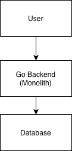
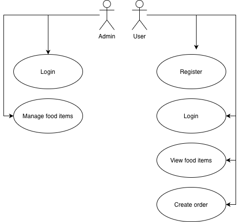
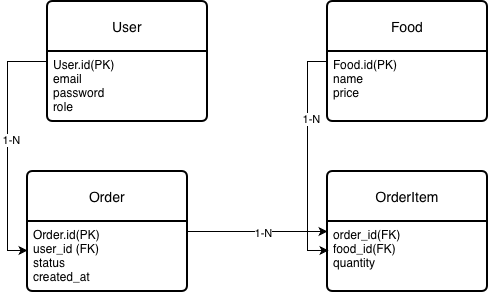
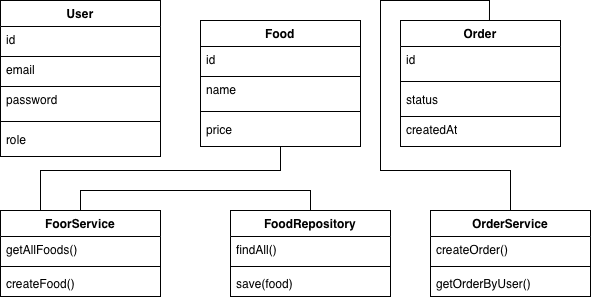

# Food Store 

## 1. Project Proposal

### 1.1 Project Relevance
Food Store is a backend application for an online food shop.
The system allows users to view food items, make orders, and check their order history.
Administrators can manage the list of food items in the store.

This project is relevant because online food stores and delivery services are very popular today.
By working on this project, we can practice real backend development concepts such as REST APIs, working with databases, user authentication, and separating business logic in a Go application.

The main goal of this project is to improve our skills in Go programming, learn how to structure a backend project properly, and gain experience working in a team using Git.
### 1.2 Competitor Analysis
There are many existing food ordering platforms, for example:
* Glovo – a large and complex platform focused on food delivery.
* Wolt – provides food delivery services with advanced logistics features.
* Uber Eats – an enterprise-level system with a very complex architecture.

Compared to these platforms, the Food Store project is much simpler.
It is designed mainly for educational purposes and focuses only on core backend functionality.
This makes it suitable for learning and understanding backend development concepts without unnecessary complexity.

### 1.3 Target Users
The system is designed for two main types of users:
* Customers – users who browse food items and place orders.
* Administrators – users who manage food items and monitor orders in the system.

### 1.4 Planned Features
The project is planned to include the following features:
* User registration and login
* Viewing available food items
* Creating and managing orders
* Viewing order history
* Administrator functionality for adding, updating, and deleting food items

At this stage, user interface design and detailed user workflows are not included.

## 2. Architecture & Design
### 2.1 Architecture Overview
The project uses a monolithic architecture, where all components are contained within a single Go application.

This approach was chosen because:
* It is easier to develop and debug for a student project
* It reduces complexity
* It aligns with the assignment requirements

### 2.2 System Architecture Diagram

### 2.3 Use Case Diagram

### 2.4 ERD

### 2.5 UML Class Diagram

## 3. Project Plan (Gantt)

| Week | Task                         | Team Member    |
|------|------------------------------|----------------|
| 7    | Project proposal & diagrams  | Aldiyar/Ayadil |
| 8    | Backend skeleton & routing   | Aldiyar/Ayadil |
| 9    | Models & repositories        | Aldiyar/Ayadil |
| 10   | Integration & basic testing  | Aldiyar/Ayadil |

## 4. Repository Setup

The project is hosted in a single GitHub repository.

To support team collaboration:
- A separate branch is created for each team member
- Each team member has at least one commit in their own branch

This setup demonstrates basic Git workflow and team-based development.